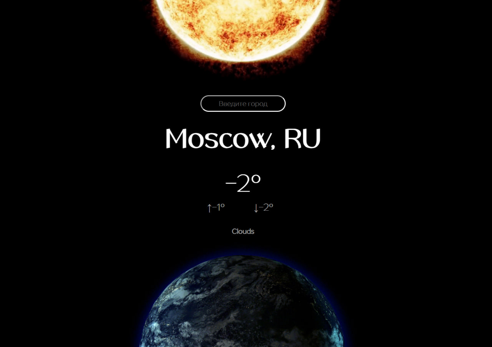

# Погода

## Структура проекта:
1. App.js: Главный компонент приложения, отображает форму ввода и результаты погоды.
2. CurrentWeather.js: Компонент для отображения текущей погоды.
3. api.js: Модуль для выполнения запросов к API погоды.
4. utils.js: Вспомогательные функции для обработки данных погоды и форматирования дат.

## Главные особенности проекта:
- Используется хук useState для хранения состояния формы ввода и данных погоды.
- Реализована функция getWeather для получения данных о погоде из API.
- Данные о погоде отображаются с использованием компонентов CurrentWeather и Forecast.
- Вид и расположение элементов стилизованы с использованием CSS.

## Запуск проекта
- git clone https://github.com/LyubimtsevaK/weather.git
- cd weather
- npm install
- npm start
